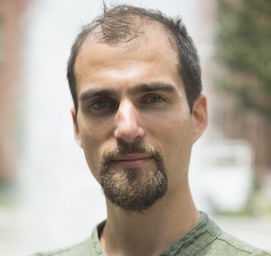
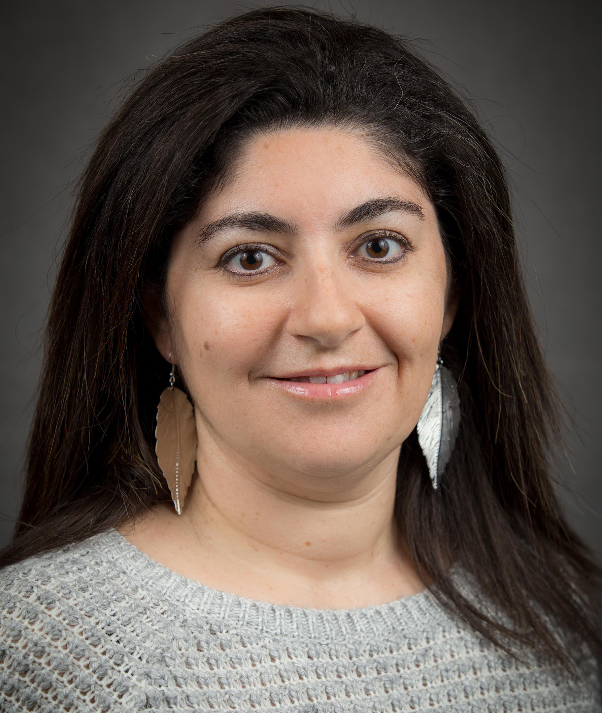
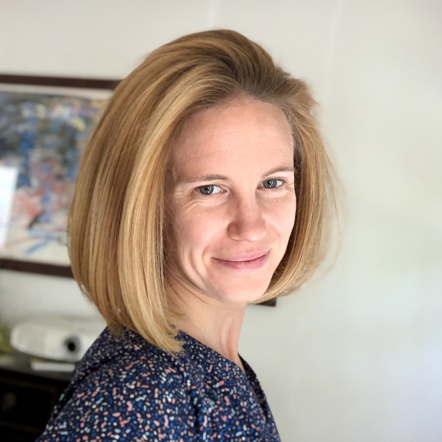
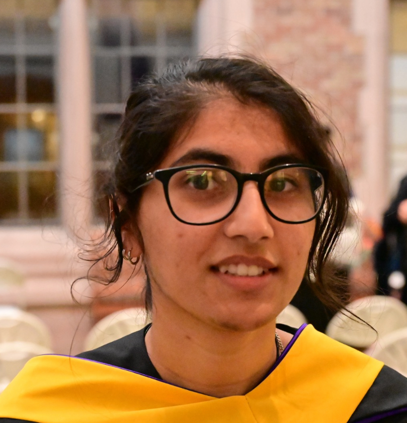
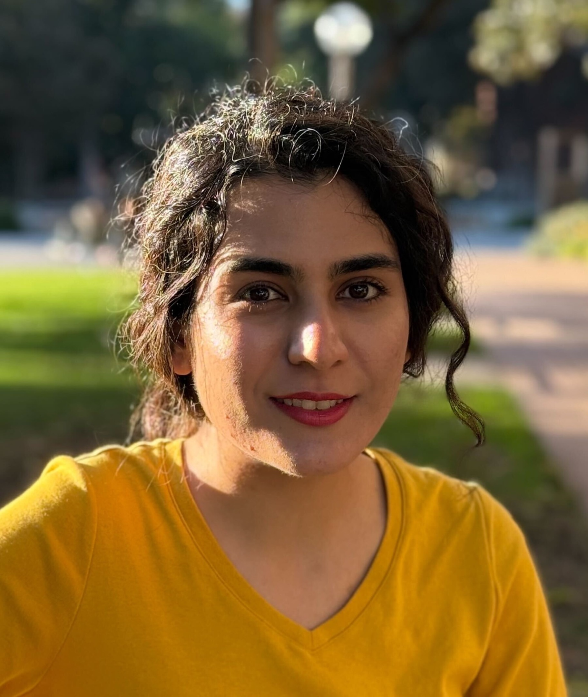

```{=html}
<style>
/* ── Person card (photo left, bio right) ─────────────────────────────────── */
.person-card {
  display: flex;
  align-items: flex-start;
  gap: 1.5rem;
  margin-bottom: 2.5rem;
}

.person-card img {
  width: 150px;
  max-height: 180px;
  object-fit: cover;
  object-position: top;
  flex-shrink: 0;
  box-shadow: 0 2px 8px rgba(0,0,0,0.18);
  border: 1px solid #d0d8e4;
  border-radius: 4px;
}

.person-card .person-info h3 {
  margin-top: 0;
  margin-bottom: 0.2rem;
}

.person-card .person-role {
  color: #4682B4;
  font-size: 0.9rem;
  font-weight: 500;
  margin-bottom: 0.5rem;
}

/* ── Alumni list ─────────────────────────────────────────────────────────── */
.alumni-entry {
  margin-bottom: 0.75rem;
}

.alumni-entry .alumni-now {
  color: #6C757D;
  font-size: 0.9rem;
}

@media (max-width: 600px) {
  .person-card {
    flex-direction: column;
    align-items: center;
    text-align: center;
  }
}
</style>
```

Our lab forges deep expertise in climate and data science, with alumni now enjoying stable positions in academia or industry.

## Principal Investigator

:::: {.person-card}
{alt="Julien Emile-Geay"}

::: {.person-info}
### Julien Emile-Geay
[Professor, Department of Earth Sciences, USC]{.person-role}

Julien is principal investigator, agitator-in-chief, and occasionally takes the group out to lunch. 
:::
::::

{width=100% style="border-radius:6px;box-shadow:0 2px 8px rgba(0,0,0,0.15);margin-bottom:2rem;"}

---

## Current Members


:::: {.person-card}
{alt="Deborah Khider"}

::: {.person-info}
### [Deborah Khider](https://knowledgecaptureanddiscovery.github.io/authors/deborah-khider/)
[Honorary Member — Research Lead, USC Information Sciences Institute]{.person-role}

Deborah is a co-conspirator on a number of our projects. Together with Nick McKay and J.E.G., they form the leadership of the [LinkedEarth organization](https://linked.earth) and its myriad offshoots.
:::
::::


:::: {.person-card}
{alt="Jordan Landers"}

::: {.person-info}
### Jordan Landers
[PhD Student]{.person-role}

Jordan's research focuses on paleoclimatology, causal inference, and the development of paleoclimate workflows and software (PaleoBooks, Pyleoclim).
:::
::::

:::: {.person-card}
{alt="Tanaya Gondhalekar"}

::: {.person-info}
### Tanaya Gondhalekar
[PhD Student]{.person-role}

Tanaya works on paleoclimate data assimilation and proxy system modeling, with a focus on the Last Millennium Reanalysis (LMR4D) and proxy system modeling.
:::
::::

:::: {.person-card}
{alt="Maryam Niati"}

::: {.person-info}
### Maryam Niati
[PhD Student]{.person-role}

Maryam's research focuses on AI in paleoclimatology as part of the PaleoPAL project. She is presently expanding Ammonyte for tipping point detection.
:::
::::

---


## Alumni

### PhD Students

:::: {.alumni-entry}
**[Alexander James](https://www.deepbluegeophysics.com/about)** — PhD 2025. *Paleoclimatology, nonlinear time series analysis.*
[→ *Geophysicist, Deep Blue Geophysics*]{.alumni-now}
::::

:::: {.alumni-entry}
**[Feng Zhu](https://staff.cgd.ucar.edu/fengzhu/)** — PhD 2021. Thesis: *Seeing the Future through the Lens of the Past: Fusing Paleoclimate Observations and Models*
[→ Assistant Professor, Nanjing University of Information Science and Technology]{.alumni-now}
::::

:::: {.alumni-entry}
**[Jun Hu](https://www.junhu.info)** — PhD 2019. Thesis: *Flowstone Ideograms: Deciphering the Climate Messages of Asian Speleothems*
[→ Associate Professor, Xiamen University]{.alumni-now}
::::

:::: {.alumni-entry}
**[Sylvia Dee](https://sylviadeeclimate.org)** — PhD 2015. Thesis: *A multi-model framework for high-resolution paleoclimatology: tracking signals from climate to proxy systems via water isotope systematics*
[→ Assistant Professor, Rice University]{.alumni-now}
::::

:::: {.alumni-entry}
**[Jianghao Wang](https://www.linkedin.com/in/jianghao-wang-896aa1a4/)** — PhD 2015. Thesis: *Taking the temperature of the Common Era: statistics, patterns and dynamical insights*
[→ Data Scientist, The MathWorks, Inc.]{.alumni-now}
::::

### Master's Students

:::: {.alumni-entry}
**[Francis Murray](https://www.linkedin.com/in/franciswmurray/)** — MS EPFL 2024. Thesis: *Machine learning approaches to predicting the El Niño-Southern oscillation*
[→ Data Scientist, Rolex]{.alumni-now}
::::


### Postdocs

:::: {.alumni-entry}
**[Michael Erb](https://www.michaelerb.org)** — *Data assimilation, climate modeling*
[→ Research Associate Professor, Appalachian State University]{.alumni-now}
::::

:::: {.alumni-entry}
**[Maud Comboul](https://www.linkedin.com/in/maud-comboul-7182058/)** — *Stochastic modeling, reconstruction*
[→ Assistant Professor, Université Côte d'Azur (Nice)]{.alumni-now}
::::

:::: {.alumni-entry}
**[Dominique Guillot](http://www.math.udel.edu/~dguillot/)** — *Statistics, climate field reconstruction*
[→ Associate Professor of Mathematical Sciences, University of Delaware]{.alumni-now}
::::

### Undergraduate Students

:::: {.alumni-entry}
**[Adam Vaccaro](https://www.linkedin.com/in/advaccaro/)**
[→ Scientific Applications Software Engineer, NASA Jet Propulsion Laboratory]{.alumni-now}
::::

:::: {.alumni-entry}
**[Yuxin Zhou](https://scholar.google.com/citations?user=381uqXwAAAAJ&hl=en)**
[→ Postdoc, UC Santa Barbara (PhD from Columbia University)]{.alumni-now}
::::

:::: {.alumni-entry}
**[Tiffany Tsai](https://www.linkedin.com/in/tiffanyts/)**
[→ Data Scientist, Zillow]{.alumni-now}
::::

:::: {.alumni-entry}
**[Jill Hardy](https://www.linkedin.com/in/jillhardy/)**
[→ Research Associate, National Weather Service Warning Decision Training Division]{.alumni-now}
::::
